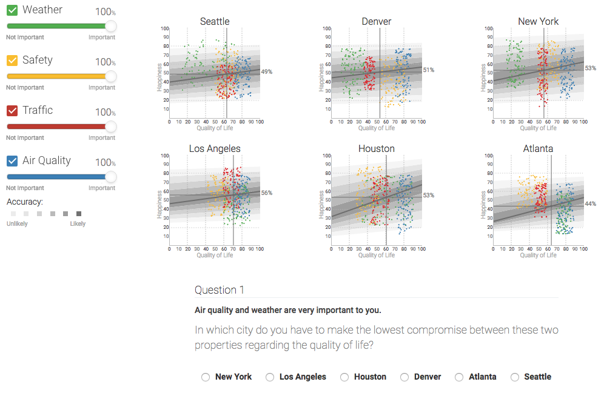
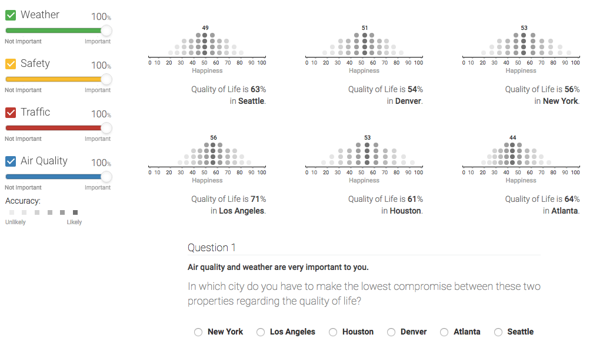
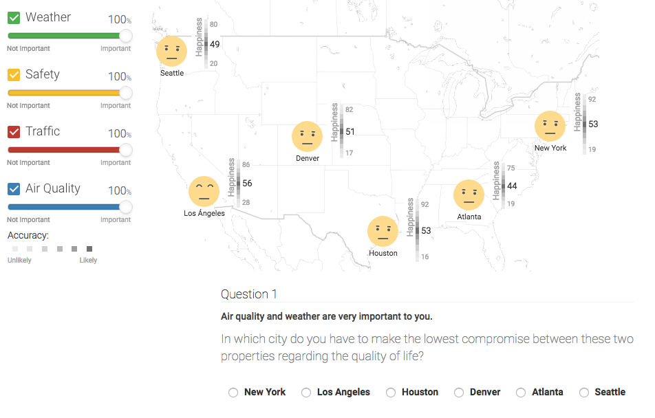

# LifeQualityViz

A dashboard to predict people's happiness in different cities across the U.S. using different viusalizations.

### A classic linear regression plot:

### A friendly chernoff faces UI:

### A dotplot viz to represent probability:

- FranciscoGutierrez@cs.kuleuven.be
- Augment HCI, KU Leuven
